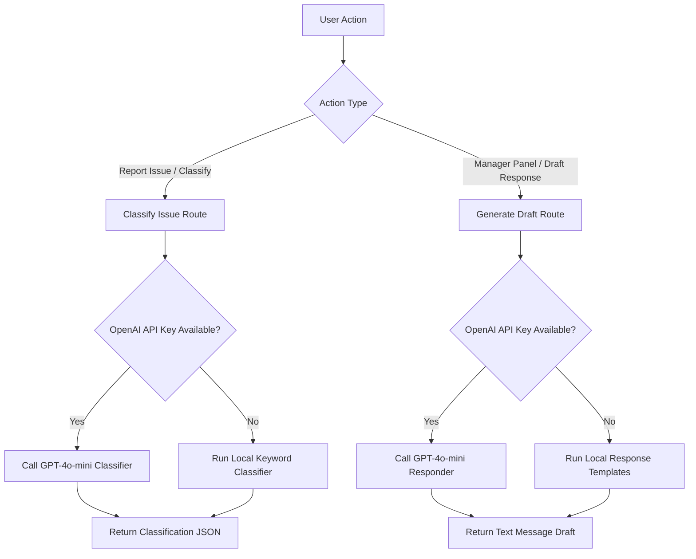

# AI Service Workflow & Prompt Design

This document details the AI-assisted workflows (Classification & Support Response Drafting) implemented in the Shield Client Issue Tracker.

---

## 🧠 Core Workflows



---

## 📋 Feature 1: Issue Classification (Severity & Category)

### 1. OpenAI Implementation
When a client inputs an issue description and requests classification, the system calls `/api/ai` (action: `classify`). The system prompts OpenAI's `gpt-4o-mini` model.

**System Prompt:**
```
You are an IT support assistant. Analyze the user's issue description and classify it.
You MUST respond with a raw JSON object containing exactly two keys:
1. "category": must be one of "BUG", "FEEDBACK", "SUGGESTION", "IMPROVEMENT"
2. "severity": must be one of "LOW", "MEDIUM", "HIGH", "CRITICAL"

Keep it short. Output ONLY the JSON. Do not include markdown code block formatting (like ```json).
```

**User Prompt:**
```
Description: "{user_issue_description}"
```

**JSON Output Format:**
```json
{
  "category": "BUG",
  "severity": "CRITICAL"
}
```

### 2. Heuristic Local Fallback
If the API key is not configured, the service matches keywords against the lowercase description:

*   **Category Logic**:
    - `SUGGESTION`: Triggered if text matches "suggest", "feature", "would be nice", "add support".
    - `FEEDBACK`: Triggered if text matches "feedback", "opinion", "love", "dislike".
    - `IMPROVEMENT`: Triggered if text matches "slow", "performance", "lag", "optimize", "speed".
    - `BUG` (Default): Triggered if text matches "crash", "fail", "bug", "error", "broken", "not working", "500".

*   **Severity Logic**:
    - `CRITICAL`: Triggered if text matches "crash", "down", "offline", "completely broken", "failing for all", "payment fail".
    - `HIGH`: Triggered if text matches "error", "bug", "cannot access", "failed" AND includes "urgent", "blocker", "asap".
    - `MEDIUM` (Default): Default fallback value.
    - `LOW`: Triggered if text matches "minor", "typo", "spacing", "color", "font".

---

## ✉️ Feature 2: Support Response Drafting

### 1. OpenAI Implementation
When a support manager views a ticket details page and clicks **Generate AI Response**, the system queries the ticket info and calls `/api/ai` (action: `respond`).

**System Prompt:**
```
You are a professional Customer Support Manager for a website monitoring SaaS.
Draft a professional, empathetic, and polite response email/comment to a client who reported an issue.
Write only the comment message body itself. Do not include subject lines, greetings like "Dear Client", signatures, or placeholders.
Tailor the tone and content to the issue's severity ({severity}), category ({category}), and current status ({status}) on website "{websiteName}".
```

**User Prompt:**
```
Issue Title: "{title}"
Description: "{description}"
```

**Expected Response Output:**
- Raw, copy-ready text paragraphs matching the issue state.

### 2. Heuristic Local Fallback
When no API key exists, the service reads the issue status and returns dynamic templates:

*   **Status: `OPEN` or `IN_REVIEW`**:
    - *"Hi, thank you for reporting the issue regarding "{title}" on {websiteName}. We have received your ticket and our team is currently reviewing the logs to identify the root cause. We will keep you updated as we progress."*
*   **Status: `IN_PROGRESS`**:
    - *"Hello, our engineering team is actively working on resolving the issue "${title}" on ${websiteName}. We have identified the problem area and are implementing a fix. Thank you for your patience..."*
*   **Status: `WAITING_FOR_CLIENT`**:
    - *"Hi, thank you for your patience. Our team is investigating "${title}", but we require a little more context. Could you please provide steps to reproduce..."*
*   **Status: `RESOLVED`**:
    - *"Hello! We are pleased to inform you that the issue "${title}" on ${websiteName} has been successfully resolved. Our tests indicate everything is running smoothly..."*
*   **Status: `CLOSED`**:
    - *"Hi, this ticket has been marked as closed. If you run into any other troubles... please feel free to open a new support request."*
