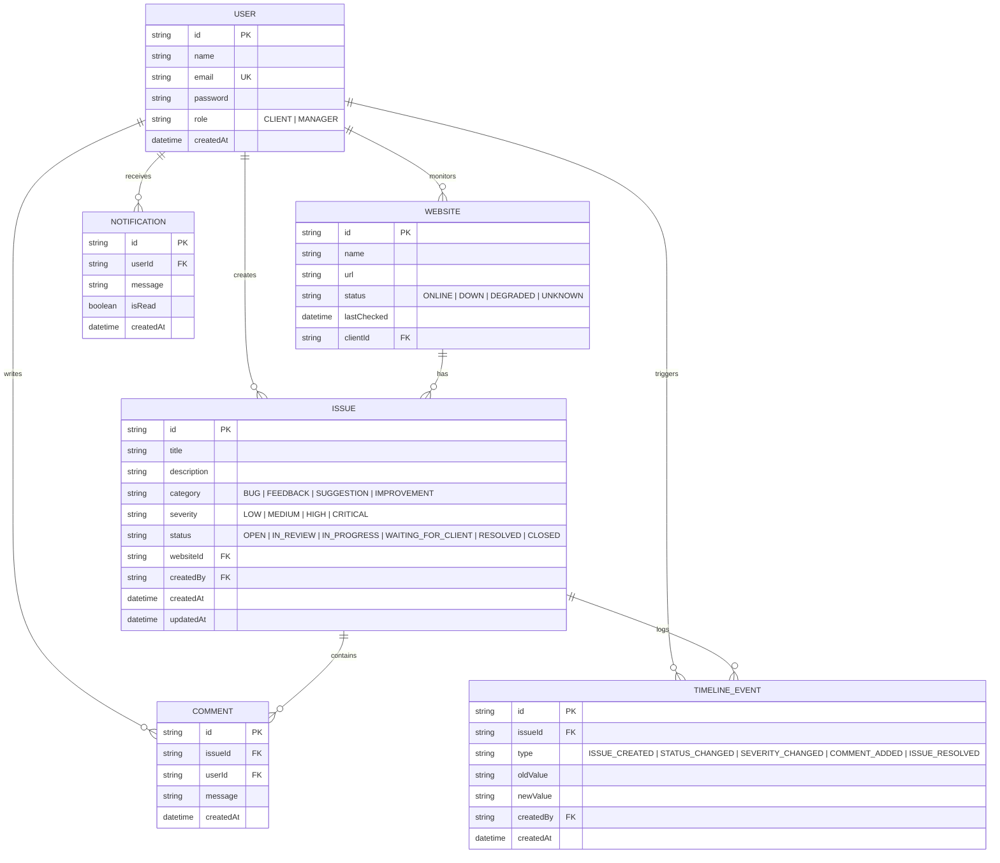

# System Architecture - Client Issue Tracker

This document describes the software layers, database designs, authentication mechanisms, and component responsibilities of the Shield Client Issue Tracker.

---

## 🏛️ System Overview

The application is structured as a fullstack Next.js web application utilizing the **App Router** pattern.

```mermaid
graph TD
    subgraph Client Layer (React CSR)
        A[Login Page]
        B[Dashboard Page]
        C[Reporting Form]
        D[Issue Details Panel]
        E[Notification Inbox]
    end

    subgraph API Route Layer (Next.js Handlers)
        F[Auth Handler]
        G[Websites API]
        H[Issues API]
        I[Comments API]
        J[Notifications API]
        K[AI Dispatcher]
    end

    subgraph Business Logic
        L[AuthOptions Config]
        M[AI Service Helper]
    end

    subgraph Data Store Layer
        N[Prisma Client]
        O[(SQLite Database)]
    end

    Client Layer -->|HTTP Requests| API Route Layer
    API Route Layer --> Business Logic
    API Route Layer --> N
    N --> O
```

### 1. Presentation Layer (Frontend)
- **Framework**: Next.js 15+ React Server Components (RSC) and Client Components (CSR).
- **Styling**: Tailwind CSS v4.0.0 CSS-variable design system.
- **State Management**: NextAuth Client Context, React state.

### 2. Service Layer (Backend APIs)
- **Route Handlers**: Implemented under `src/app/api/...` executing database operations and AI calls.
- **Middleware**: Intercepts requests for authentication redirects.

### 3. Integration Layer (AI Services)
- Handles interaction with OpenAI API or local heuristics engine.

### 4. Database Layer (ORM & DB)
- **ORM**: Prisma Client utilizing the `PrismaBetterSqlite3` driver adapter.
- **DB**: SQLite for local environment, structured to be SQL-compatible for easy PostgreSQL transition.

---

## 🗄️ Database Design (Entity Relationships)



---

## 🚦 Endpoint Routing Map

| Method | Path | Description | Access |
| :--- | :--- | :--- | :--- |
| **POST** | `/api/auth/signin` | Signs in user credentials | Public |
| **POST** | `/api/auth/signout`| Destroys session | Authenticated |
| **GET** | `/api/websites` | List client or manager websites | Authenticated |
| **GET** | `/api/websites/:id` | Fetch specific website metadata | Client Owner / Manager |
| **GET** | `/api/issues` | List filtered issues index | Client Creator / Manager |
| **POST** | `/api/issues` | Create support request | Client |
| **GET** | `/api/issues/:id` | Get issue, comment thread, and timeline | Client Creator / Manager |
| **PATCH**| `/api/issues/:id` | Update status/severity (triggers client notify) | Client Creator (Close only) / Manager |
| **POST** | `/api/issues/:id/comments` | Post a thread message | Client Creator / Manager |
| **GET** | `/api/notifications` | Get client notifications | Client |
| **PATCH**| `/api/notifications` | Mark a specific or all alerts as read | Client |
| **POST** | `/api/ai` | Dispatch AI classification or auto-replies | Client (classify) / Manager (respond) |
